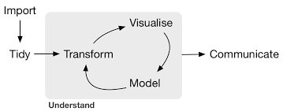
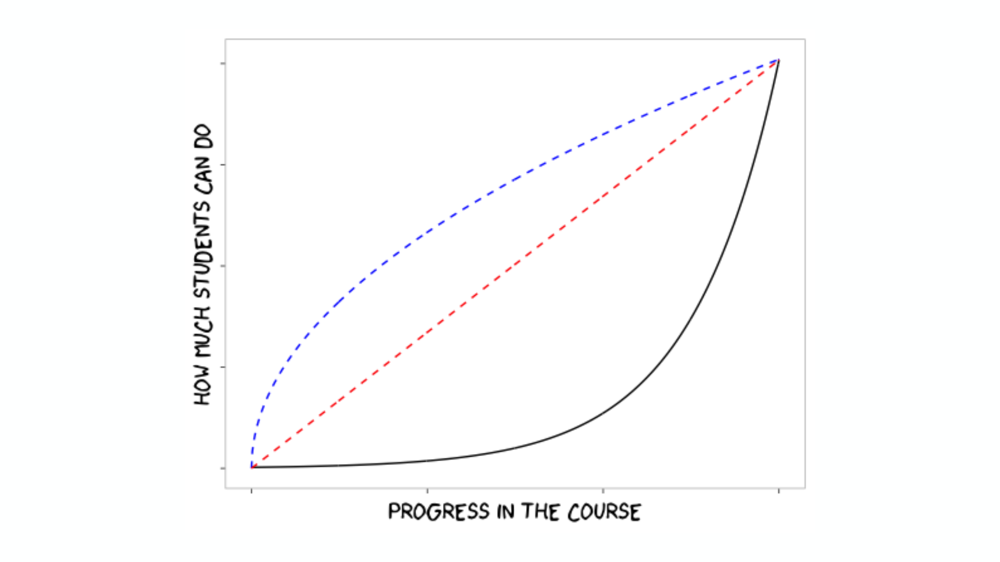

```{r setup, include=FALSE}
knitr::opts_chunk$set(echo = FALSE)
```

## All things rstudio

<br><br><br><br>
```{r, fig.align='right'}

```


## Motivation

```{r, fig.align='center', out.width = '70%'}

```

From data to outputs

## Motivation

```{r, fig.align = 'center', out.width = "70%"}
knitr::include_graphics('tidyverse/images/01_tidyverse_data_science.png')
```

A generalised data analysis workflow

## Motivation

<center>
###Get more stuff done
</center>

- faster
- accurately
- reproducibly

## Tips and tricks

Getting to see how "the pro's" operate

## Faster

keyboard shortcut for keyboard shortcuts (alt + shift + k)


key shortcuts:

- ctrl + shift + M
- ctrl + .
- ctrl + shift + F10
- tab complete

## Faster (2)

automate the boring stuff

- usethis::create_project("/path/to/my/new/project")
- usethis::create_package("/path/to/my/new/package")

## Consistency

- data first
- prefixes
- suffixes
- plan for pipes

## Design

<center>
"It's better to optimise for comprehension speed rather than typing speed" 
<br><br><br>
"Naming things is hard work"
<br><br><br>
"Fail fast and fail hard"
</center>
<br><br>
<div align='right'>
\- Hadley Wickham
</div>

## Accurately

informal testing

- eyeball test

formal testing

- automated coded tests

```{r, fig.align='right', out.width= '30%'}
knitr::include_graphics('tidyverse/images/testthat.png')
```


## Reproducibly

- data, code, text as single compiled document 
- Restart session and restart often


## Ease of access

rstudio 1.1 new features

- database connections
- extra git functionality
- terminal

## Teaching

Base R vs Tidyverse

Order matters

```{r, fig.align='right', out.width= '90%'}

```

## Things I learnt at rstudio::rconf

But wish I had known about ages ago
<br><br>

- purrr (package)
- usethis (package)
- dotfiles
- ctrl + .
- !!
- how to use the debugger

```{r, fig.align='right', out.width= '15%'}
knitr::include_graphics('tidyverse/images/purrr.png')
```


